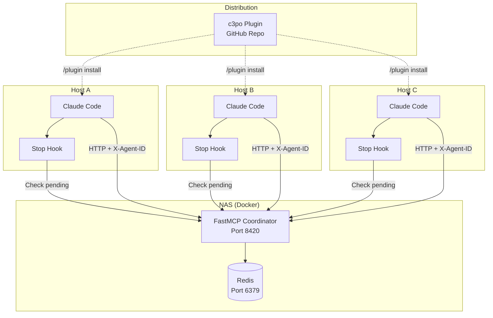
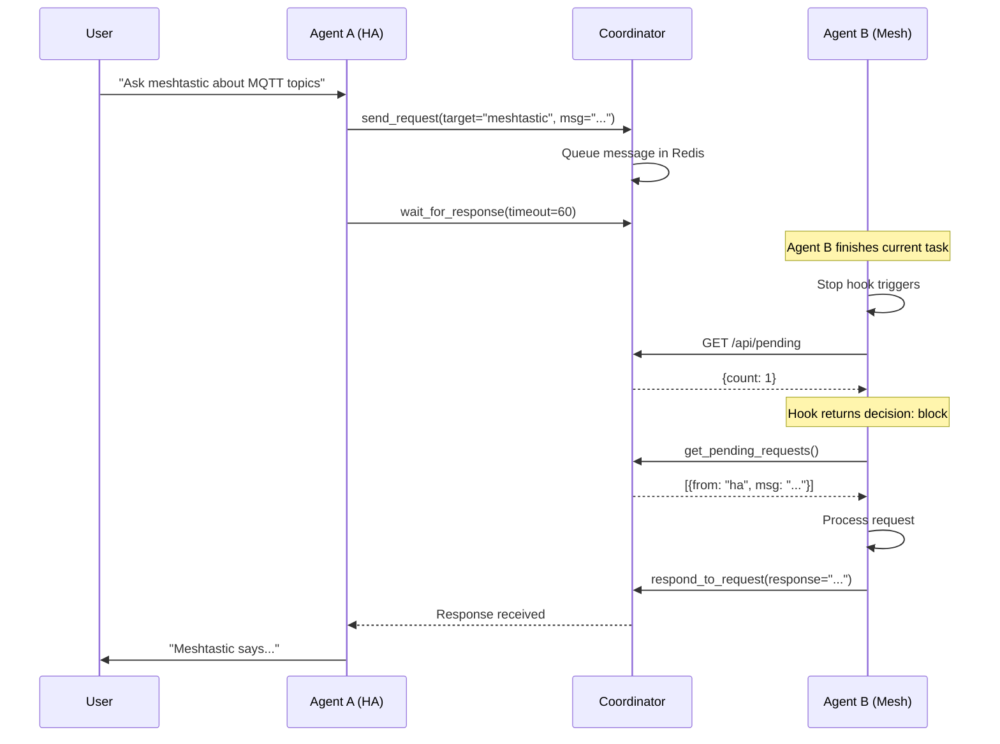

# C3PO Detailed Design Document

## Claude Code Control Panel and Orchestrator

**Version:** 1.0 (MVP)
**Date:** 2026-01-28

---

## 1. Overview

C3PO is a coordination layer that enables multiple Claude Code instances running on different hosts to collaborate on cross-cutting problems. Each CC instance maintains context about its domain (e.g., Home Assistant, Meshtastic, media server) and can request help from other instances without human relay.

### 1.1 Key Value Proposition

A user working with the Home Assistant agent can say "debug why Meshtastic sensor data isn't appearing" and the HA agent will automatically reach out to the Meshtastic agent, have a multi-turn conversation to diagnose the issue, and report back—all without the human switching terminals or relaying messages.

### 1.2 Design Principles

1. **Minimal per-host setup**: Install plugin with one command, no local runtime required
2. **Human stays in control**: Can interrupt any agent at any time, agents escalate when uncertain
3. **Graceful degradation**: Works normally if coordinator is down
4. **Explicit collaboration**: Human initiates agent linking, no automatic cross-agent chatter

---

## 2. Detailed Requirements

### 2.1 Core Functionality

| ID | Requirement | Priority |
|----|-------------|----------|
| R1 | Agent A can send a request to Agent B and receive a response | Must |
| R2 | Agents can have multi-turn async conversations (back-and-forth) | Must |
| R3 | Human can interrupt any agent at any time (Esc, Ctrl-C) | Must |
| R4 | Agents can escalate to human when uncertain | Must |
| R5 | Agents discover other available agents | Must |
| R6 | System degrades gracefully when coordinator unavailable | Must |
| R7 | Coordination can be enabled/disabled easily | Must |

### 2.2 User Experience

| ID | Requirement | Priority |
|----|-------------|----------|
| U1 | Per-host setup via single plugin install command | Must |
| U2 | Agent name defaults to project folder name | Must |
| U3 | Coordinator handles agent name collisions (auto-suffix) | Must |
| U4 | Human explicitly directs agents to collaborate | Must |
| U5 | No automatic agent-to-agent suggestions (keeps prompts simple) | Must |

### 2.3 Infrastructure

| ID | Requirement | Priority |
|----|-------------|----------|
| I1 | Central coordinator runs on Docker (Synology NAS) | Must |
| I2 | Uses Redis for message storage | Must |
| I3 | Local network only (no internet exposure for MVP) | Must |
| I4 | No authentication for MVP (trusted home network) | Should |

### 2.4 Acceptance Criteria Summary

- **AC1**: Basic request/response between agents (< 10s latency)
- **AC2**: Human interrupt stops processing immediately
- **AC3**: AI escalation pauses coordination and prompts human
- **AC4**: Human can resume coordination mode
- **AC5**: New host joins network in < 15 minutes
- **AC6**: Coordination tools fail gracefully when network down
- **AC7**: Enable/disable via simple command or config

---

## 3. Architecture Overview

### 3.1 System Architecture



### 3.2 Component Overview

| Component | Location | Technology | Purpose |
|-----------|----------|------------|---------|
| c3po Plugin | GitHub repo | CC Plugin format | Distribution, hooks, skills |
| Coordinator | NAS Docker | FastMCP (Python) | Message routing, agent registry |
| Redis | NAS Docker | Redis 7 | Message queues, agent state |
| Stop Hook | Each host (via plugin) | Python script | Check for pending requests |

### 3.3 Communication Flow



---

## 4. Components and Interfaces

### 4.1 Coordinator MCP Server

The coordinator exposes these MCP tools to Claude Code instances:

#### 4.1.1 Agent Management

| Tool | Parameters | Returns | Description |
|------|------------|---------|-------------|
| `register_agent` | `name?: string, capabilities?: string[]` | `{agent_id, name}` | Register this instance (auto-called on connect) |
| `list_agents` | none | `[{id, name, status, last_seen}]` | List all known agents |
| `get_agent_status` | `agent_id: string` | `{status, last_seen, current_task}` | Get specific agent status |

#### 4.1.2 Messaging

| Tool | Parameters | Returns | Description |
|------|------------|---------|-------------|
| `send_request` | `target: string, message: string, context?: string` | `{request_id, status}` | Send request to another agent |
| `get_pending_requests` | none | `[{id, from, message, context, timestamp}]` | Get all pending requests for this agent |
| `respond_to_request` | `request_id: string, response: string, status?: string` | `{success}` | Respond to a request |
| `wait_for_response` | `request_id: string, timeout?: int` | `{response, status}` or `{timeout: true}` | Block until response arrives |
| `wait_for_request` | `timeout?: int` | `{request}` or `{timeout: true}` | Block until a request arrives |

#### 4.1.3 Coordination Control

| Tool | Parameters | Returns | Description |
|------|------------|---------|-------------|
| `set_status` | `status: string` | `{success}` | Set agent status (available, busy, away) |
| `escalate_to_human` | `reason: string` | `{success}` | Mark this agent as needing human input |

### 4.2 Coordinator REST API

For hooks and health checks (non-MCP):

| Endpoint | Method | Purpose |
|----------|--------|---------|
| `/mcp` | POST | FastMCP HTTP transport endpoint |
| `/api/pending` | GET | Quick check for pending requests (for Stop hook) |
| `/api/health` | GET | Health check |
| `/api/agents` | GET | List agents (for debugging) |

### 4.3 Plugin Structure

```
c3po/
├── .claude-plugin/
│   └── plugin.json              # Plugin manifest
├── .mcp.json                    # MCP server configuration
├── hooks/
│   ├── check_inbox.py           # Stop hook script
│   └── register_agent.py        # SessionStart hook script
├── skills/
│   └── coordinate/
│       └── SKILL.md             # /coordinate skill
├── coordinator/                 # Coordinator source (for self-hosting)
│   ├── Dockerfile
│   ├── docker-compose.yml
│   ├── requirements.txt
│   └── server.py
└── README.md
```

### 4.4 Plugin Configuration

**.claude-plugin/plugin.json:**
```json
{
  "name": "c3po",
  "description": "Multi-agent coordination for Claude Code",
  "version": "1.0.0",
  "hooks": {
    "Stop": [{
      "matcher": {},
      "hooks": [{
        "type": "command",
        "command": "python3 ${CLAUDE_PLUGIN_ROOT}/hooks/check_inbox.py"
      }]
    }],
    "SessionStart": [{
      "matcher": {"source": ["startup", "resume"]},
      "hooks": [{
        "type": "command",
        "command": "python3 ${CLAUDE_PLUGIN_ROOT}/hooks/register_agent.py"
      }]
    }]
  }
}
```

**.mcp.json:**
```json
{
  "mcpServers": {
    "c3po": {
      "type": "http",
      "url": "${C3PO_COORDINATOR_URL:-http://localhost:8420}/mcp",
      "headers": {
        "X-Agent-ID": "${C3PO_AGENT_ID:-${PWD##*/}}"
      }
    }
  }
}
```

---

## 5. Data Models

### 5.1 Agent Record

Stored in Redis hash `agents`:

```json
{
  "id": "homeassistant",
  "name": "homeassistant",
  "display_name": "Home Assistant",
  "capabilities": ["mqtt", "zigbee", "automation"],
  "status": "available",
  "last_seen": "2026-01-28T10:30:00Z",
  "session_id": "abc123",
  "current_task": null
}
```

### 5.2 Request Message

Stored in Redis list `inbox:{agent_id}`:

```json
{
  "id": "homeassistant-meshtastic-1706438400.123",
  "from_agent": "homeassistant",
  "to_agent": "meshtastic",
  "message": "What MQTT topic does node 0x1234 publish to?",
  "context": "Trying to configure HA sensor for this node",
  "timestamp": "2026-01-28T10:30:00Z",
  "status": "pending",
  "priority": "normal"
}
```

### 5.3 Response Message

Stored in Redis list `responses:{agent_id}`:

```json
{
  "request_id": "homeassistant-meshtastic-1706438400.123",
  "from_agent": "meshtastic",
  "to_agent": "homeassistant",
  "response": "Node 0x1234 publishes to mesh/node/1234/sensors",
  "status": "success",
  "timestamp": "2026-01-28T10:30:15Z"
}
```

### 5.4 Redis Key Structure

| Key Pattern | Type | TTL | Purpose |
|-------------|------|-----|---------|
| `agents` | Hash | None | Agent registry (field = agent_id) |
| `inbox:{agent_id}` | List | 24h | Pending requests for agent |
| `responses:{agent_id}` | List | 1h | Responses waiting to be retrieved |
| `agent:{agent_id}:status` | String | 5m | Quick status check with auto-expire |

---

## 6. Error Handling

### 6.1 Coordinator Unavailable

**Detection:** HTTP connection timeout or error

**Behavior:**
- MCP tools return clear error: `{"error": "Coordinator unavailable", "code": "COORD_DOWN"}`
- Agent continues normal operation for local tasks
- Stop hook fails open (allows stop, doesn't block)

**User experience:**
```
⚠️ c3po coordinator is not reachable. Coordination features disabled.
You can continue working locally. Run /coordinate status to check connection.
```

### 6.2 Target Agent Unavailable

**Detection:** Agent not in registry or status = "away"

**Behavior:**
- `send_request` returns: `{"error": "Agent 'meshtastic' is not available", "code": "AGENT_UNAVAILABLE"}`
- Suggests available agents if any exist

### 6.3 Request Timeout

**Detection:** `wait_for_response` timeout expires

**Behavior:**
- Returns: `{"timeout": true, "request_id": "...", "waited_seconds": 60}`
- Request stays in target's inbox (they may still respond)
- Agent can retry or report timeout to user

### 6.4 Agent Name Collision

**Detection:** Registration with existing name

**Behavior:**
- Coordinator auto-suffixes: `homeassistant` → `homeassistant-2`
- Returns canonical name in registration response
- Hook updates local environment if needed

### 6.5 Human Interrupt During Coordination

**Detection:** User presses Esc/Ctrl-C or types interrupt phrase

**Behavior:**
- CC's normal interrupt handling takes over
- In-flight `wait_for_response` is cancelled
- Agent marks current task as interrupted
- Other agents waiting for response eventually timeout

---

## 7. Testing Strategy

### 7.1 Unit Tests

| Component | Test Focus |
|-----------|------------|
| Coordinator tools | Each MCP tool in isolation with mock Redis |
| Message routing | Request/response flow with multiple agents |
| Name collision | Auto-suffix logic |
| Timeout handling | Redis BLPOP timeout behavior |

### 7.2 Integration Tests

| Test | Setup | Verification |
|------|-------|--------------|
| Two-agent request/response | 2 CC instances, coordinator, Redis | Agent A sends, B receives and responds |
| Multi-turn conversation | 2 CC instances | 3+ round trips complete successfully |
| Coordinator restart | Kill and restart coordinator | Agents reconnect, pending messages survive |
| Agent disconnect | Kill one CC instance | Other agent's request times out gracefully |

### 7.3 Manual Testing Checklist

- [ ] Install plugin on fresh CC instance
- [ ] Agent registers with folder name
- [ ] `list_agents` shows registered agents
- [ ] Send request to another agent
- [ ] Receive and respond to request
- [ ] Stop hook triggers on pending request
- [ ] Coordinator down: graceful error message
- [ ] Human interrupt works during coordination
- [ ] Name collision produces unique name

### 7.4 Demo Scenarios

**Demo 1: Basic Coordination**
```
Host A (homeassistant folder):
> "Ask the meshtastic agent what MQTT topics it uses"
[Agent A sends request, waits]
[Agent B receives via stop hook, responds]
> "Meshtastic says it uses mesh/# for all topics"
```

**Demo 2: Multi-turn Troubleshooting**
```
Host A:
> "Work with meshtastic to debug why sensor data isn't appearing in HA"
[Multiple back-and-forth exchanges]
> "Found the issue: node was in sleep mode. Meshtastic agent woke it up."
```

---

## 8. Appendices

### A. Technology Choices

| Choice | Selected | Alternatives Considered | Rationale |
|--------|----------|------------------------|-----------|
| Coordinator framework | FastMCP (Python) | mcp-framework (TS), custom | Best docs, Python ecosystem, quick to develop |
| Message store | Redis | SQLite, PostgreSQL, custom | Native pub/sub, BLPOP for blocking, simple |
| Distribution | CC Plugin | NPM package, git clone | One-command install, includes hooks |
| Agent identity | X-Agent-ID header | Bearer token, query param | Simple, no auth needed for home lab |
| Incoming requests | Stop hook + blocking tool | Polling, SSE notifications | Works with CC's limitations |

### B. Research Findings Summary

1. **CC Hooks** can block Claude from stopping and inject instructions
2. **FastMCP** supports HTTP transport with multiple concurrent clients
3. **MCP notifications** are received but not acted upon by CC
4. **Blocking MCP tools** are the reliable pattern for waiting on external events
5. **HCOM project** validates the hooks + message queue approach

### C. Alternative Approaches Considered

**Per-host MCP server:** Rejected because user wanted minimal per-host setup and some hosts are resource-constrained.

**Pure polling:** Rejected because it requires agent to actively check, adds latency, and complicates prompts.

**SSE notifications:** Not viable because CC doesn't auto-act on notifications.

**HCOM integration:** Could be used, but adds SQLite dependency and different patterns. May revisit post-MVP.

### D. Future Enhancements (Post-MVP)

1. **Authentication**: Add Bearer token auth for non-home-lab deployments
2. **Encryption**: TLS for coordinator connections
3. **Agent suggestions**: "I notice meshtastic might help here. Should I reach out?"
4. **Persistent conversations**: Track multi-turn context across sessions
5. **Web dashboard**: Visualization of agent network and message flow
6. **Priority queues**: Urgent requests processed first

### E. Configuration Reference

**Environment Variables:**

| Variable | Default | Description |
|----------|---------|-------------|
| `C3PO_COORDINATOR_URL` | `http://localhost:8420` | Coordinator URL |
| `C3PO_AGENT_ID` | `${PWD##*/}` (folder name) | Agent identifier |
| `C3PO_TIMEOUT` | `60` | Default request timeout (seconds) |

**Docker Compose (coordinator/docker-compose.yml):**
```yaml
version: '3.8'
services:
  coordinator:
    build: .
    ports:
      - "8420:8420"
    environment:
      - REDIS_URL=redis://redis:6379
    depends_on:
      - redis

  redis:
    image: redis:7-alpine
    volumes:
      - redis_data:/data
    command: redis-server --appendonly yes

volumes:
  redis_data:
```

---

## 9. Glossary

| Term | Definition |
|------|------------|
| Agent | A Claude Code instance participating in coordination |
| Coordinator | Central service that routes messages between agents |
| Domain | Legacy term for agent (from original spec) |
| Escalation | When an agent pauses and asks for human input |
| Handoff | Explicit transfer of a task between agents |
| Stop hook | CC hook that runs when Claude finishes a task |
